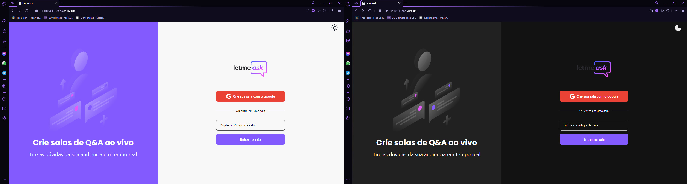
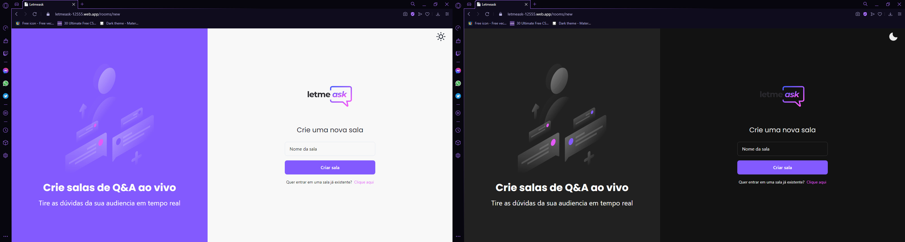
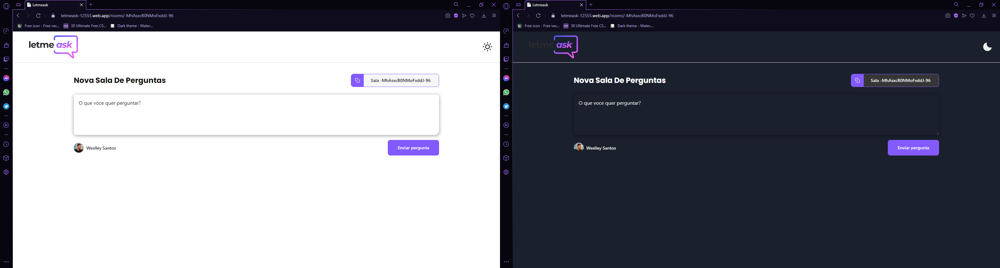
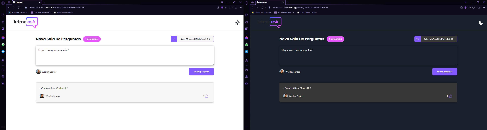
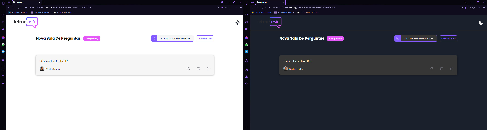

<p align="center">
  
</p>

<h1 align="center">
    
</h1>

<br>

## 🧪 Technologies

This project was developed using the following technologies:

- [React](https://reactjs.org)
- [Firebase](https://firebase.google.com/)
- [TypeScript](https://www.typescriptlang.org/)

## 🚀 Getting started

Clone the project and access the folder.

```bash
$ git clone https://github.com/WeslleySOR/letmeask.git
$ cd letmeask
```

Follow the steps below:
```bash
# Install the dependencies
$ yarn

# Start the project
$ yarn start
```
The app will be available for access on your browser at https://letmeask-12555.web.app/

## 🔖 Layout

You can view the project layout through the links below:

- [Layout Web](https://www.figma.com/file/u0BQK8rCf2KgzcukdRRCWh/Letmeask/duplicate) 

Remembering that you need to have a [Figma](http://figma.com/) account to access it.

## 📝 Update [15/08/2021]

<h1>Home</h1>
<h2 align="center">
    
</h2>
<h1>New Room</h1>
<h2 align="center">
    
</h2>
<h1>User Room</h1>
<h2 align="center">
    
    
</h2>
<h1>Admin Room</h1>
<h2 align="center">
    
</h2>

## 📝 License

This project is licensed under the MIT License. See the [LICENSE](LICENSE) file for details.


---

<p align="center">Made with 💜 by Weslley Ruas</p>
